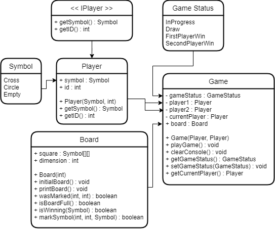

## Code Workflow

- Player start the game
- Player input the row and col to insert the Symbol he has
- System will check the row and col based on the given input
- Loop the game if there is no one wins or draw the game
- Stop the game if there is no empty square or one of the player wins

## Game Case

1. If there is no empty square, then stop the game and then print `Draw!`
2. If every square in the row/col/diagonal was marked with the same `Symbol`, then stop the game with gameStatus = who player wins

## UML Diagram

 

## Folder Structure

The workspace contains two folders by default, where:

- `src`: the folder to maintain sources
- `lib`: the folder to maintain dependencies

Meanwhile, the compiled output files will be generated in the `bin` folder by default.

> If you want to customize the folder structure, open `.vscode/settings.json` and update the related settings there.

## Dependency Management

The `JAVA PROJECTS` view allows you to manage your dependencies. More details can be found [here](https://github.com/microsoft/vscode-java-dependency#manage-dependencies).
